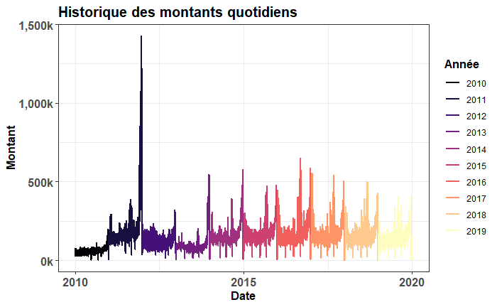

# Analysis of the record of book sales

Cette analyse a pour but d’explorer le comportement historique de ventes de 
livres dans la région de Montréal et dans la région de Québec entre les années 
2010 et 2019. Les graphiques ont été generées avec la librairie `ggplo2`. 

